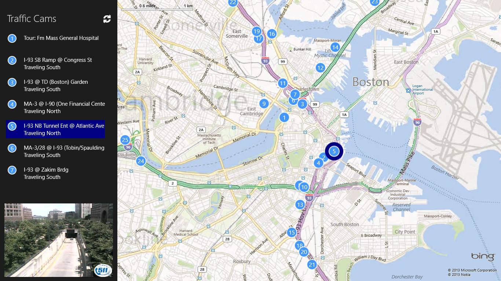

##Traffic Cams Windows Store App
##Date: 6/3/2013
##Version: v1.0
##Author(s): Jim O'Neil

----------
###Description
The Traffic Cams app extends the [APIMASH TomTom/Bing Maps Starter Kit][1] with additional functionality on the road to it becoming a published application in the Windows Store.

##DISCLAIMER: 
The sample code described herein is provided on an "as is" basis, without warranty of any kind, to the fullest extent permitted by law. Both Microsoft and I do not warrant or guarantee the individual success developers may have in implementing the sample code on their development platforms or in using their own Web server configurations. 

Microsoft and I do not warrant, guarantee or make any representations regarding the use, results of use, accuracy, timeliness or completeness of any data or information relating to the sample code. Microsoft and I disclaim all warranties, express or implied, and in particular, disclaims all warranties of merchantability, fitness for a particular purpose, and warranties related to the code, or any service or software related thereto. 

Microsoft and I shall not be liable for any direct, indirect or consequential damages or costs of any type arising out of any action taken by you or others related to the sample code.

[1]:https://github.com/apimash/StarterKits/tree/master/APIMASH_TomTom_BingMaps_StarterKit
